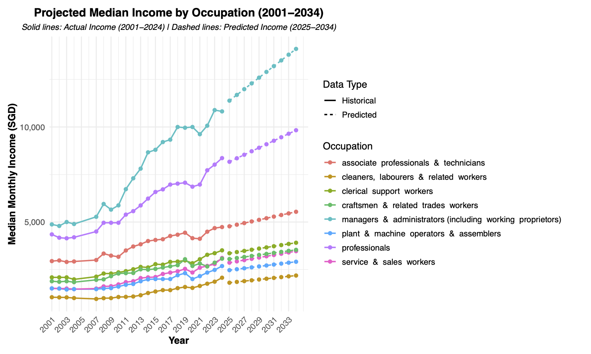

# 💼 Compensation Insights Dashboard
*Capstone Project: Google Data Analytics Professional Certificate*

## 🧩 Portfolio Ready ・ Completed June 2025

## 📌 Project Summary
This project explores income distribution, salary movements, and compensation trends across industries and occupations in Singapore from  1996 to 2024. Built in R, this dashboard uncovers income patterns and benchmarking insights relevant to HR professionals, policymakers and compensation analysts.

## 🧰 Tools & Techniques 
- **Languages & Platforms:** R, RStudio, GitHub
- **Libraries Used:** `tidyverse` (incl. `ggplot2`, `dplyr`, `tidyr`, `readr`)
- **Data Tasks:** Data cleaning, wrangling, outlier handling, visualization and PDF export
- **Workflow:** Modular R scripts,  organized folder structure, GitHub version control

## 📊 Key Visualizations
- Median Income Trends by Percentile (p20, p50)
- Income Comparison by Industry and Occupation (2024)
- Multi-year Income Trend Lines (1996 - 2024)
- Key Insights Summary on Income Patterns by Occupation & Industry (2001-2034)
- All charts exported to `viz_output/` as PDF files

### 🖼️ Preview: Occupation Income Projection Chart
[](viz_output/projection_occupation_income_trend.pdf)

## 📁 Repository Structure

```
📁 data/
- raw/         # Original datasets
- cleaned/     # Cleaned datasets for analysis

📁 scripts/    # R scripts for data processing, analysis and projection
- load_and_inspect_data.R                # Load and preview income datasets
- eda_income.R                           # Perform exploratory data analysis
- clean_income_data.R                    # Clean datasets for occupation and industry
- project_income_industry_predict.R      # Forecast income by industry (2001-2034)
- project_income_occupation_predict.R    # Forecast occupation by industry (2001-2034)

📁 viz_output/ # Exported chart PDFs

📁 docs/       # Daily recaps and insights summary (optional)
- occupation_income_trend_analysis_integrated.docx       # Occupation trend analysis + recommendations
- industry_income_trend_analysis_integrated.docx         # Industry trend analysis + recommendations
- occupation_industry_highlights_summary.docx            # Combined occupation and industry trends for portfolio

📄 README.md   # Project summary and structure
```

## 🎓 Certification
Google Data Analytics Professional Certificate (Coursera, 2025)

## 📫 Contact
**Jenny Kong Ching Woon**
📧 jenny.kongcw@gmail.com

